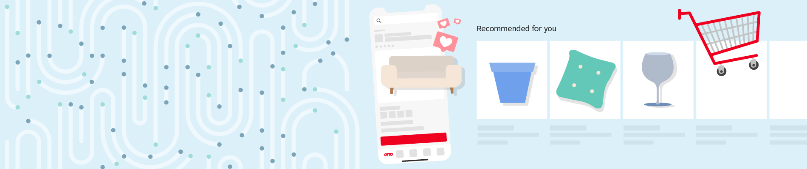
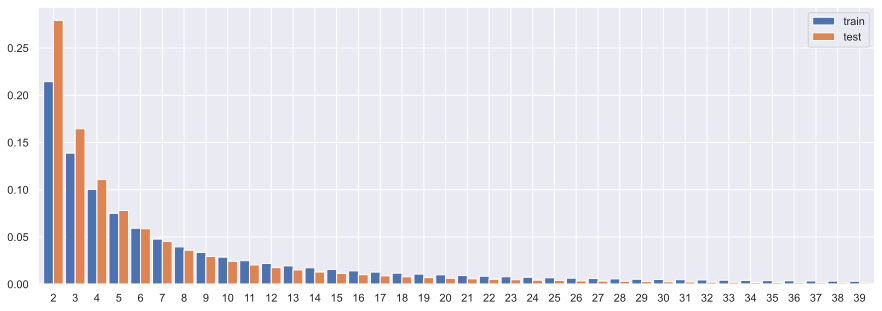
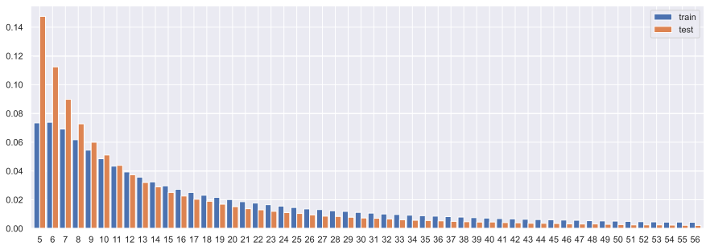
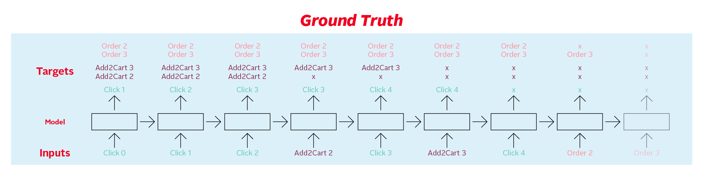
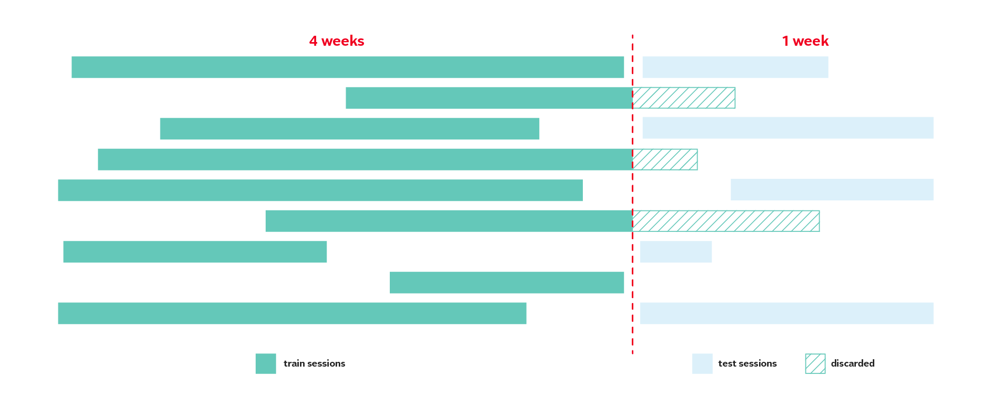

<div align="center">

# OTTO Recommender Systems Dataset

[](https://github.com/otto-de/recsys-dataset)
[](https://github.com/otto-de/recsys-dataset/actions/workflows/test.yml)
[](https://www.kaggle.com/competitions/otto-recommender-system)
[](https://www.otto.de/jobs/technology/ueberblick/)

**A real-world e-commerce dataset for session-based recommender systems research.**



---

<p align="center">
  <a href="#get-the-data">Get the Data</a> •
  <a href="#data-format">Data Format</a> •
  <a href="#installation">Installation</a> •
  <a href="#evaluation">Evaluation</a> •
  <a href="#faq">FAQ</a> •
  <a href="#license">License</a>
</p>

</div>

The `OTTO` session dataset is a large-scale dataset intended for multi-objective recommendation research. We collected the data from anonymized behavior logs of the [OTTO](https://otto.de) webshop and the app. The mission of this dataset is to serve as a benchmark for session-based recommendations and foster research in the multi-objective and session-based recommender systems area. We also launched a [Kaggle competition](https://www.kaggle.com/competitions/otto-recommender-system) with the goal to predict clicks, cart additions, and orders based on previous events in a user session.

_Please scroll down to the bottom of this README file for instructions specific to the COMP9417 Group Project_

## Key Features

- 12M real-world anonymized user sessions
- 220M events, consiting of `clicks`, `carts` and `orders`
- 1.8M unique articles in the catalogue
- Ready to use data in `.jsonl` format
- Evaluation metrics for multi-objective optimization

## Dataset Statistics

| Dataset |  #sessions |    #items |     #events |     #clicks |     #carts |   #orders | Density [%] |
| :------ | ---------: | --------: | ----------: | ----------: | ---------: | --------: | ----------: |
| Train   | 12.899.779 | 1.855.603 | 216.716.096 | 194.720.954 | 16.896.191 | 5.098.951 |      0.0005 |
| Test    |  1.671.803 | 1.019.357 |  13.851.293 |  12.340.303 |  1.155.698 |   355.292 |      0.0005 |

|                           |  mean |   std | min | 50% | 75% | 90% | 95% | max |
| :------------------------ | ----: | ----: | --: | --: | --: | --: | --: | --: |
| Train #events per session | 16.80 | 33.58 |   2 |   6 |  15 |  39 |  68 | 500 |
| Test #events per session  |  8.29 | 13.74 |   2 |   4 |   8 |  18 |  28 | 498 |

<details>
    <summary><strong>#events per session histogram (90th percentile)</strong></summary>
    
</details>

|                        |   mean |    std | min | 50% | 75% | 90% | 95% |    max |
| :--------------------- | -----: | -----: | --: | --: | --: | --: | --: | -----: |
| Train #events per item | 116.79 | 728.85 |   3 |  20 |  56 | 183 | 398 | 129004 |
| Test #events per item  |  13.59 |  70.48 |   1 |   3 |   9 |  24 |  46 |  17068 |

<details>
    <summary><strong>#events per item histogram (90th percentile)</strong></summary>
    
</details>

## Get the Data

The data is stored on the [Kaggle](https://www.kaggle.com/competitions/otto-recommender-system/data) platform and can be downloaded using their API:

```Shell
kaggle datasets download -d otto/recsys-dataset
```

## Data Format

The sessions are stored as `JSON` objects containing a unique `session` ID and a list of `events`:

```JSON
{
    "session": 42,
    "events": [
        { "aid": 0, "ts": 1661200010000, "type": "clicks" },
        { "aid": 1, "ts": 1661200020000, "type": "clicks" },
        { "aid": 2, "ts": 1661200030000, "type": "clicks" },
        { "aid": 2, "ts": 1661200040000, "type": "carts"  },
        { "aid": 3, "ts": 1661200050000, "type": "clicks" },
        { "aid": 3, "ts": 1661200060000, "type": "carts"  },
        { "aid": 4, "ts": 1661200070000, "type": "clicks" },
        { "aid": 2, "ts": 1661200080000, "type": "orders" },
        { "aid": 3, "ts": 1661200080000, "type": "orders" }
    ]
}
```

- `session` - the unique session id
- `events` - the time ordered sequence of events in the session
  - `aid` - the article id (product code) of the associated event
  - `ts` - the Unix timestamp of the event
  - `type` - the event type, i.e., whether a product was clicked, added to the user's cart, or ordered during the session

## Submission Format

For each `session` id and `type` combination in the test set, you must predict the `aid` values in the `label` column, which is space delimited. You can predict up to 20 `aid` values per row. The file should contain a header and have the following format:

```CSV
session_type,labels
42_clicks,0 1 2 3 4 5 6 7 8 9 10 11 12 13 14 15 16 17 18 19
42_carts,0 1 2 3 4 5 6 7 8 9 10 11 12 13 14 15 16 17 18 19
42_orders,0 1 2 3 4 5 6 7 8 9 10 11 12 13 14 15 16 17 18 19
```

## Installation

To run our scripts, you need to have [Python 3](https://www.python.org/downloads/) and [Pipenv](https://pipenv.pypa.io/en/latest/) installed. Then, you can install the dependencies with:

```bash
pipenv sync
```

## Evaluation

Submissions are evaluated on [Recall](<https://en.wikipedia.org/wiki/Evaluation_measures_(information_retrieval)#Recall>)@20 for each action `type`, and the three recall values are weight-averaged:

$$
score = 0.10 \cdot R_{clicks} + 0.30 \cdot R_{carts} + 0.60 \cdot R_{orders}
$$

where $R$ is defined as

$$
R_{type} = \frac{ \sum\limits_{i=1}^N | \\{ \text{predicted aids} \\}\_{i, type} \cap \\{ \text{ground truth aids} \\}\_{i, type} | }{ \sum\limits_{i=1}^N \min{( 20, | \\{ \text{ground truth aids} \\}_{i, type} | )}}
$$

and $N$ is the total number of sessions in the test set, and $\text{predicted aids}$ are the predictions for each session-type (e.g., each row in the submission file) _truncated after the first 20 predictions_.

For each `session` in the test data, your task it to predict the `aid` values for each `type` that occur after the last timestamp `ts` the test session. In other words, the test data contains sessions truncated by timestamp, and you are to predict what occurs after the point of truncation.

For `clicks` there is only a single ground truth value for each session, which is the next `aid` clicked during the session (although you can still predict up to 20 `aid` values). The ground truth for `carts` and `orders` contains all `aid` values that were added to a cart and ordered respectively during the session.



<details>
  <summary><strong>Click here to see the labeled session as <code>JSON</code> from above</strong></summary>

```JSON
[
    {
        "aid": 0,
        "ts": 1661200010000,
        "type": "clicks",
        "labels": {
            "clicks": 1,
            "carts": [2, 3],
            "orders": [2, 3]
        }
    },
    {
        "aid": 1,
        "ts": 1661200020000,
        "type": "clicks",
        "labels": {
            "clicks": 2,
            "carts": [2, 3],
            "orders": [2, 3]
        }
    },
    {
        "aid": 2,
        "ts": 1661200030000,
        "type": "clicks",
        "labels": {
            "clicks": 3,
            "carts": [2, 3],
            "orders": [2, 3]
        }
    },
    {
        "aid": 2,
        "ts": 1661200040000,
        "type": "carts",
        "labels": {
            "clicks": 3,
            "carts": [3],
            "orders": [2, 3]
        }
    },
    {
        "aid": 3,
        "ts": 1661200050000,
        "type": "clicks",
        "labels": {
            "clicks": 4,
            "carts": [3],
            "orders": [2, 3]
        }
    },
    {
        "aid": 3,
        "ts": 1661200060000,
        "type": "carts",
        "labels": {
            "clicks": 4,
            "orders": [2, 3]
        }
    },
    {
        "aid": 4,
        "ts": 1661200070000,
        "type": "clicks",
        "labels": {
            "orders": [2, 3]
        }
    },
    {
        "aid": 2,
        "ts": 1661200080000,
        "type": "orders",
        "labels": {
            "orders": [3]
        }
    }
]
```

</details>

To create these labels from unlabeled sessions, you can use the function, `ground_truth` in [labels.py](src/labels.py).

### Train/Test Split

Since we want to evaluate a model's performance in the future, as would be the case when we deploy such a system in an actual webshop, we choose a time-based validation split. Our train set consists of observations from 4 weeks, while the test set contains user sessions from the following week. Furthermore, we trimmed train sessions overlapping with the test period, as depicted in the following diagram, to prevent information leakage from the future:

<div align="center">
  
</div>

We will publish the final test set after the Kaggle [competition](https://www.kaggle.com/competitions/otto-recommender-system) is finalized. However, until then, participants of the competition can create their truncated test sets from the training sessions and use this to evaluate their models offline. For this purpose, we include a Python script called `testset.py`:

```Shell
pipenv run python -m src.testset --train-set train.jsonl --days 2 --output-path 'out/' --seed 42
```

### Metrics Calculation

You can use the `evalute.py` script to calculate the Recall@20 for each action type and the weighted average Recall@20 for your submission:

```Shell
pipenv run python -m src.evaluate --test-labels test_labels.jsonl --predictions predictions.csv
```

## FAQ

### How is a user `session` defined?

- A session is all activity by a single user either in the train or the test set.

### Are there identical users in the train and test data?

- No, train and test users are completely disjunct.

### Are all test `aids` included in the train set?

- Yes, all test items are also included in the train set.

### How can a session start with an order or a cart?

- This can happen if the ordered item was already in the customer's cart before the data extraction period started. Similarly, a wishlist in our shop can lead to cart additions without a previous click.

### Are `aids` the same as article numbers on [otto.de](otto.de)?

- No, all article and session IDs are anonymized.

### Are most of the clicks generated by our current recommendations?

- No, our current recommendations generated only about 20% of the product page views in the dataset. Most users reached product pages via search results and product lists.

### Are you allowed to train on the truncated test sessions?

- Yes, for the scope of the competition, you may use all the data we provided.

### How is Recall@20 calculated if the ground truth contains more than 20 labels?

- If you predict 20 items correctly out of the ground truth labels, you will still score 1.0.

### Where can I find item and user metadata?

- This dataset intentionally only contains anonymized IDs. Given its already large size, we deliberately did not include content features to make the dataset more manageable and focus on collaborative filtering techniques that solve the multi-objective problem.

## License

The OTTO dataset is released under the [CC-BY 4.0 License](https://creativecommons.org/licenses/by/4.0/), while the code is licensed under the [MIT License](LICENSE).

## Citation

BibTeX entry:

```BibTeX
@online{normann2022ottodataset,
  author       = {Philipp Normann, Sophie Baumeister, Timo Wilm},
  title        = {OTTO Recommender Systems Dataset: A real-world e-commerce dataset for session-based recommender systems research},
  date         = {2022-11-01},
}
```

---

# COMP9417 Group Project

This Kaggle competition was completed by a group of 3 students for the COMP9417 Machine Learning and Data Mining course at UNSW. The group members are:

- William Feng (z5309999)
- Asha Raghav (z5363204)
- Prayag Rawat (z5312819)

## Summary/Notes

- The **`test/resources/`** directory contains all the data files used for the project.
  - In the GitHub repository, you will only find a `train.jsonl` file, which simply contains the first 10 and last 10 lines of the full training data.
  - To properly run all the models, you will need to insert the [full OTTO dataset](<(https://www.kaggle.com/datasets/otto/recsys-dataset)>) here, as well as any parquet files that may be used in the data processing.
  - These files are not included in the GitHub repository due to their large size.
- The **`src/`** directory contains contains all the code for generating the 'ground truth' labels used for testing.
  - The specific commands to run the starter Python files are explained in the section below for clarity.
  - Please note that the output of running the test labels (which our generated models will be comparing against) will be generated in the `src/out/` directory.
  - Note that again, these are not included in the GitHub repository due to their large size.
- The **`process/`** directory contains all the Python files that are used to generate our models.
  - You can run each of these simply by `python <filename>`

## Running Models & Calculating Score

1. [Download](https://www.kaggle.com/datasets/otto/recsys-dataset) and place these files in the `test/resources/` directory

   - `otto-recsys-test.jsonl` (750MB)
   - `otto-recsys-train.jsonl` (11.31GB)

2. Generate Test Labels/Ground Truths (from the `src/` directory)

```shell
pipenv run python -m testset --train-set ../test/resources/otto-recsys-test.jsonl --days 2 --output-path 'out/' --seed 42
```

3. Run your model and generate a `predictions.csv` file (placed in the `process/` directory)

4. Evaluate your model (from the `src/` directory)

```shell
pipenv run python -m evaluate --test-labels out/test_labels.jsonl --predictions ../process/predictions.csv
```

5. You should see the score of the predictions from your model based on this data. However, to obtain the final private score (based on a full hidden subset of test data), you will need to submit your predictions to the [Kaggle competition](https://www.kaggle.com/competitions/otto-recommender-system/submissions).

   - If you prefer not to manually submit the submission file over the internet, you can also follow [these instructions](https://github.com/Kaggle/kaggle-api) to set up the Kaggle API and submit the `submission.csv` file via the command line.

```shell
kaggle competitions submit -c otto-recommender-system -f submission.csv -m "Message"
```
